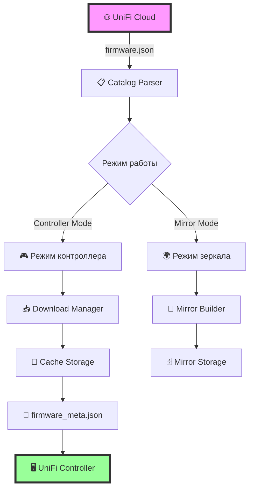
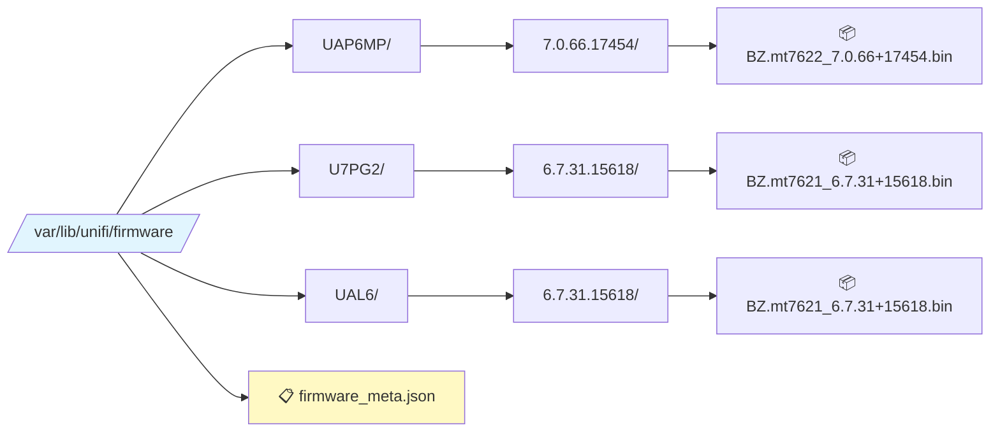
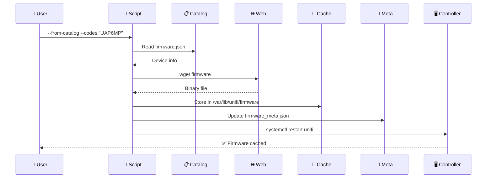
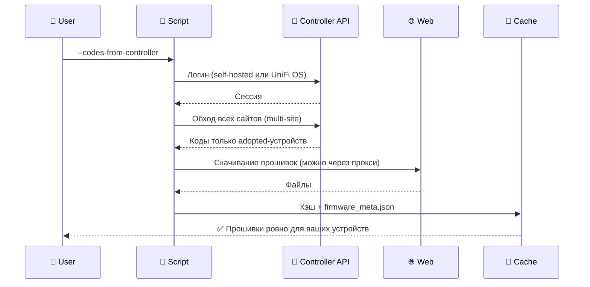
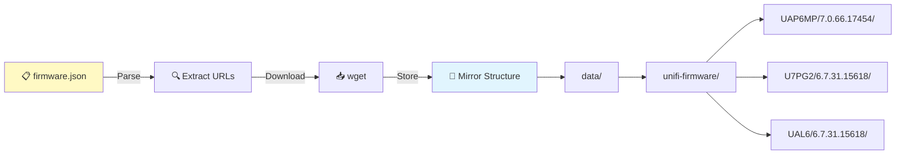

# 🚀 UniFi Firmware Cache Manager


> 💡 **Мощный инструмент для автоматизации управления прошивками UniFi в офлайн-среде**

## 📋 Содержание

- [🎯 Что это?](#-что-это)
- [✨ Возможности](#-возможности)
- [🏗️ Архитектура](#️-архитектура)
- [⚙️ Требования](#️-требования)
- [🚀 Быстрый старт](#-быстрый-старт)
- [📖 Режимы работы](#-режимы-работы)
- [🔧 Примеры использования](#-примеры-использования)
- [🌐 Работа с прокси](#-работа-с-прокси)
- [🛠️ Переменные окружения](#️-переменные-окружения)
- [🐛 Отладка](#-отладка)
- [📊 Мониторинг](#-мониторинг)
- [❓ FAQ](#-faq)

## 🎯 Что это?

**unifi-fw-cache** — это универсальный bash-скрипт для управления кэшем прошивок UniFi Network Controller. Идеальное решение для:

- 🔒 **Изолированных сетей** без доступа к интернету
- 🏢 **Корпоративных сред** с жесткими политиками безопасности
- 📦 **Массового развертывания** устройств UniFi
- 🌍 **Региональных зеркал** для ускорения обновлений

## ✨ Возможности

### 🎮 Режим контроллера
- 📥 Автоматическое скачивание прошивок из `firmware.json`
- 📂 Организация файлов в структурированное хранилище
- 🔄 Обновление `firmware_meta.json` для интеграции с UniFi
- 🔗 **Поддержка прямых URL** для скачивания прошивок
- 🎯 **Автоматическое определение совместимых устройств** из каталога
- 🔌 **Коды устройств прямо с контроллера**: `--codes-from-controller` берёт модели только adopted-устройств по всем сайтам (multi-site) через API (self-hosted и UniFi OS)
- 👤 Управление правами доступа (unifi:unifi)
- ♻️ Автоматический перезапуск службы

### 🌐 Режим зеркала
- 💾 Полное зеркалирование репозитория прошивок
- 🏗️ Создание локального хранилища fw-download.ubnt.com
- 🚀 Поддержка массового скачивания
- ✅ Проверка MD5-сумм

### 🔍 Умное определение совместимости
- 🎯 **Автопоиск совместимых устройств** по MD5, имени файла и версии
- 📋 Создание правильного поля `devices` в `firmware_meta.json`
- 🔄 Работает для всех источников: URL, локальные файлы, каталог
- 💡 Одна прошивка автоматически связывается со всеми совместимыми моделями

### 📡 Получение каталога через API
- 🚀 **Прямое получение через API Ubiquiti** (firmware.json недоступен по URL)
- 🔄 Автоматическое преобразование формата API → firmware.json
- 🎯 Фильтрация: только UniFi Network + стабильные релизы
- 💾 **Два каталога**: `firmware.ubnt.json` (оригинал) + `firmware.json` (переписанный)
- 🌐 Поддержка переписывания хостов для локальных зеркал

## 🏗️ Архитектура



### 📂 Структура кэша



## ⚙️ Требования

| Компонент | Версия | Описание |
|-----------|--------|----------|
| 🐚 **Bash** | 4.0+ | Используются массивы и process substitution |
| 🔧 **jq** | 1.5+ | Парсинг JSON каталога прошивок |
| 📥 **wget** | 1.14+ | Загрузка файлов с поддержкой докачки |
| 🔑 **md5sum** | - | Проверка целостности файлов |
| 📊 **coreutils** | 8.0+ | stat, install для управления файлами |
| 🌀 **curl** | 7.x+ | Только для `--codes-from-controller` (API контроллера) |
| 🍃 **mongosh/mongo** | - | Только для `--codes-from-db` (локальный MongoDB) |
| ⚙️ **systemd** | - | Управление службой unifi (опционально) |
| 👑 **root** | - | Доступ к /var/lib/unifi |

## 🚀 Быстрый старт

### 1️⃣ Клонирование репозитория

```bash
git clone https://github.com/your-account/unifi-fw-cache.git
cd unifi-fw-cache
chmod +x unifi-fw-cache.sh
```

### 2️⃣ Базовое использование

```bash
# 🎯 Кэшировать прошивки для конкретных устройств
sudo ./unifi-fw-cache.sh --from-catalog --codes "UAP6MP U7PG2 UAL6"

# 🔌 Или не перечислять коды вручную — скрипт сам спросит контроллер,
#    какие устройства у вас adopted (по всем сайтам)
sudo ./unifi-fw-cache.sh --codes-from-controller --api-user admin --api-pass 'секрет'

# 🔗 Скачать прошивку по прямому URL (автоматически определит совместимые устройства)
sudo ./unifi-fw-cache.sh https://dl.ui.com/unifi/firmware/U7PG2/6.7.35.15586/BZ.qca956x_6.7.35+15586.bin

# 📦 Добавить локальные файлы в кэш
sudo ./unifi-fw-cache.sh --src-dir ./firmware-files/

# 🌐 Создать полное зеркало
./unifi-fw-cache.sh --mirror-all --mirror-root /srv/unifi-mirror
```

## 📖 Режимы работы

### 🎮 Режим контроллера

Работа напрямую с кэшем UniFi Network Controller:



### 🔌 Автоопределение устройств через API контроллера

Не нужно помнить коды моделей — скрипт сам спросит контроллер, что у вас есть:



### 🌍 Режим зеркала

Создание локального зеркала всех прошивок:



## 🔧 Примеры использования

### 📥 Скачивание прошивок для конкретных моделей

```bash
# 🏢 Офисные точки доступа
sudo ./unifi-fw-cache.sh --from-catalog \
  --codes "UAP6MP UAP6LR U6MESH" \
  --app-version "9.0.131"
```

### 🔄 Использование внутреннего зеркала

```bash
# 🌐 Переопределение хоста загрузки
sudo REWRITE_HOST=mirror.local.lan \
  ./unifi-fw-cache.sh --from-catalog \
  --codes "U7PG2 UAL6"
```

### 📦 Офлайн установка из локальных файлов

```bash
# 💾 Файлы уже скачаны в папку firmware/
sudo ./unifi-fw-cache.sh --src-dir ./firmware/

# 📝 С указанием исходного URL для метаданных
sudo ./unifi-fw-cache.sh \
  --src-url "https://dl.ui.com/unifi/firmware/UAL6/6.7.31.15618/BZ.mt7621_6.7.31+15618.bin" \
  ./BZ.mt7621_6.7.31+15618.bin
```

### 🔗 Скачивание по прямым URL

```bash
# 📥 Одна прошивка по прямому URL
sudo ./unifi-fw-cache.sh \
  https://dl.ui.com/unifi/firmware/U7PG2/6.7.35.15586/BZ.qca956x_6.7.35+15586.251030.2141.bin \
  --no-restart

# 📦 Несколько прошивок за раз
sudo ./unifi-fw-cache.sh \
  https://dl.ui.com/unifi/firmware/U7PG2/6.7.35.15586/BZ.qca956x_6.7.35+15586.bin \
  https://dl.ui.com/unifi/firmware/UAP6MP/6.6.77.14836/U6Mesh.qca956x.v6.6.77.bin \
  https://dl.ui.com/unifi/firmware/USW/7.0.66.17440/US.bcm5334x.v7.0.66.bin \
  --threads 10

# 🎯 Автоматически определятся все совместимые устройства
# Вывод покажет:
# [URL] U7PG2 6.7.35 (devices: U7PG2 U7MSH U7LR) <- BZ.qca956x_6.7.35+15586.bin
```

### 🎯 Умное определение совместимости устройств

Скрипт автоматически находит все совместимые модели для каждой прошивки:

```bash
# При скачивании прошивки для U7PG2
sudo ./unifi-fw-cache.sh \
  https://dl.ui.com/unifi/firmware/U7PG2/6.7.35.15586/BZ.qca956x_6.7.35+15586.bin

# firmware_meta.json будет содержать:
# {
#   "md5": "abc123...",
#   "version": "6.7.35.15586",
#   "path": "U7PG2/6.7.35.15586/BZ.qca956x_6.7.35+15586.bin",
#   "devices": ["U7PG2", "U7MSH", "U7LR"]  ← все совместимые модели!
# }

# Поиск совместимых устройств работает по приоритетам:
# 1️⃣ По MD5 хешу (самый надёжный)
# 2️⃣ По имени файла + версии
# 3️⃣ По имени файла
# 4️⃣ Fallback к определённой модели из URL
```

### 🏗️ Создание полного зеркала

```bash
# 🌐 Рекомендуемый способ: получение каталога через API
./unifi-fw-cache.sh --fetch-catalog-api \
  --mirror-all \
  --mirror-root /srv/unifi-mirror \
  --rewrite-catalog-host fw-mirror.example.com

# Результат:
# - firmware.ubnt.json → оригинальные ссылки (для скачивания)
# - firmware.json → переписанные хосты (для контроллера)
# - data/ → скачанные файлы

# 💿 Альтернатива: использование локального каталога
./unifi-fw-cache.sh --mirror-all \
  --mirror-root /srv/unifi-mirror \
  --catalog ./firmware.json
```

### 🎯 Комбинированные сценарии

```bash
# 🚀 Скачать из каталога + добавить локальные файлы
sudo ./unifi-fw-cache.sh \
  --from-catalog --codes "UAP6MP" \
  --src-dir ./additional-firmware/ \
  https://dl.ui.com/unifi/firmware/U7PG2/special.bin
```

### 🔌 Кэширование по данным контроллера (multi-site)

```bash
# Посмотреть, какие коды adopted-устройств видит контроллер (read-only, root не нужен)
./unifi-fw-cache.sh --list-controller-codes --api-creds-file /etc/unifi-fw-cache.creds

# Скачать прошивки для всех adopted-устройств (работает и через прокси: sudo -E)
sudo -E ./unifi-fw-cache.sh --auto-update-catalog --codes-from-controller \
  --api-creds-file /etc/unifi-fw-cache.creds

# Только точки доступа со всех сайтов
sudo -E ./unifi-fw-cache.sh --codes-from-controller --filter '^U' \
  --api-creds-file /etc/unifi-fw-cache.creds

# Файл кредов (chmod 600):
#   UNIFI_API_URL=https://localhost:8443
#   UNIFI_API_USER=admin
#   UNIFI_API_PASS=secret
# Важно: у администратора не должна быть включена 2FA (создайте локального админа)

# Вариант без учётки — напрямую из локального MongoDB контроллера
sudo ./unifi-fw-cache.sh --codes-from-db
```

## 🌐 Работа с прокси

### 📡 Настройка wget для прокси

```bash
# HTTP прокси
export http_proxy=http://proxy.company.com:3128
export https_proxy=http://proxy.company.com:3128

# SOCKS5 прокси (требуется tsocks/proxychains)
proxychains ./unifi-fw-cache.sh --from-catalog --codes "UAP6MP"
```

### 🔀 Переопределение хоста загрузки

```bash
# Использовать внутреннее зеркало
REWRITE_HOST=unifi-mirror.local.lan \
  sudo -E ./unifi-fw-cache.sh --from-catalog --codes "UAP6MP"
```

## 🛠️ Переменные окружения

| Переменная | По умолчанию | Описание |
|------------|--------------|----------|
| 📁 `UNIFI_FW_DIR` | `/var/lib/unifi/firmware` | Директория кэша прошивок |
| 📋 `CATALOG` | `/var/lib/unifi/firmware.json` | Путь к каталогу прошивок |
| 🔢 `APP_VERSION` | auto | Версия контроллера (auto = последняя) |
| 👤 `UNIFI_USER` | `unifi` | Владелец файлов |
| 👥 `UNIFI_GROUP` | `unifi` | Группа файлов |
| ♻️ `RESTART` | `1` | Перезапускать службу (1/0) |
| 🌐 `REWRITE_HOST` | - | Заменить хост при загрузке |
| 📂 `MIRROR_ROOT` | `.` | Корень для режима зеркала |
| 🔌 `UNIFI_API_URL` | `https://localhost:8443` | Адрес контроллера для `--codes-from-controller` |
| 👤 `UNIFI_API_USER` | - | Логин администратора API контроллера |
| 🔑 `UNIFI_API_PASS` | - | Пароль администратора API (лучше через файл кредов) |

### 💡 Примеры использования переменных

```bash
# 🔧 Кастомная директория кэша
UNIFI_FW_DIR=/opt/unifi-cache sudo ./unifi-fw-cache.sh --from-catalog --codes "UAP6MP"

# 🚫 Без перезапуска службы
RESTART=0 sudo ./unifi-fw-cache.sh --src-dir ./firmware/

# 📌 Фиксированная версия контроллера
APP_VERSION=8.5.6 sudo ./unifi-fw-cache.sh --from-catalog --codes "U7PG2"
```

## 🐛 Отладка

### 📝 Проверка логов

```bash
# 🔍 Логи контроллера UniFi
grep -i firmware_meta /usr/lib/unifi/logs/server.log | tail -n 50

# 📊 Статус службы
systemctl status unifi

# 🗂️ Проверка кэша
ls -la /var/lib/unifi/firmware/
cat /var/lib/unifi/firmware/firmware_meta.json | jq .
```

### 🔧 Режим отладки

```bash
# 🐞 Включить отладку bash
bash -x ./unifi-fw-cache.sh --from-catalog --codes "UAP6MP"

# 📋 Проверить содержимое каталога
jq '.["9.0.131"].release | keys' /var/lib/unifi/firmware.json

# 🔌 Проверить подключение к API контроллера (read-only, ничего не скачивает)
./unifi-fw-cache.sh --list-controller-codes --api-creds-file /etc/unifi-fw-cache.creds
```

## 📊 Мониторинг

### 📈 Статистика кэша

```bash
# 📦 Размер кэша
du -sh /var/lib/unifi/firmware/

# 📋 Количество прошивок
find /var/lib/unifi/firmware -name "*.bin" -o -name "*.tar" | wc -l

# 🔍 Группировка по устройствам
for dir in /var/lib/unifi/firmware/*/; do
  device=$(basename "$dir")
  count=$(find "$dir" -name "*.bin" -o -name "*.tar" | wc -l)
  echo "📱 $device: $count firmware(s)"
done
```

### 🔄 Автоматизация через cron

```bash
# Добавить в crontab
# 🌙 Ежедневное обновление кэша в 3:00
0 3 * * * /opt/unifi-fw-cache/unifi-fw-cache.sh --from-catalog --codes "UAP6MP U7PG2 UAL6" >> /var/log/unifi-fw-cache.log 2>&1

# 🔌 То же, но без хардкода кодов: скрипт сам узнаёт устройства у контроллера.
#    Купили новую модель точки — прошивка для неё появится в кэше автоматически
0 3 * * * /opt/unifi-fw-cache/unifi-fw-cache.sh --auto-update-catalog --codes-from-controller --api-creds-file /etc/unifi-fw-cache.creds >> /var/log/unifi-fw-cache.log 2>&1

# 📅 Еженедельное полное зеркалирование
0 2 * * 0 /opt/unifi-fw-cache/unifi-fw-cache.sh --mirror-all --mirror-root /srv/unifi-mirror >> /var/log/unifi-mirror.log 2>&1
```

## ❓ FAQ

### ❌ Контроллер не видит кэш

**Симптомы:** После выполнения скрипта прошивки не появляются в UI контроллера.

**Решение:**
```bash
# 1️⃣ Проверить права доступа
ls -la /var/lib/unifi/firmware/
chown -R unifi:unifi /var/lib/unifi/firmware/

# 2️⃣ Проверить формат firmware_meta.json
jq . /var/lib/unifi/firmware/firmware_meta.json

# 3️⃣ Перезапустить контроллер
systemctl restart unifi

# 4️⃣ Проверить логи
tail -f /usr/lib/unifi/logs/server.log
```

### 🔒 Ошибки доступа

**Симптомы:** Permission denied при записи файлов.

**Решение:**
```bash
# ✅ Запускать с sudo
sudo ./unifi-fw-cache.sh --from-catalog --codes "UAP6MP"

# 🔧 Или изменить переменные окружения
UNIFI_USER=$USER UNIFI_GROUP=$USER RESTART=0 ./unifi-fw-cache.sh ...
```

### 🌐 Проблемы с загрузкой

**Симптомы:** wget не может скачать файлы.

**Решение:**
```bash
# 🔍 Проверить доступность
wget --spider https://dl.ui.com/unifi/firmware/UAP6MP/7.0.66.17454/BZ.mt7622_7.0.66+17454.240913.0102.bin

# 🌐 Использовать прокси
export https_proxy=http://proxy:3128
sudo -E ./unifi-fw-cache.sh --from-catalog --codes "UAP6MP"

# 🔀 Или внутреннее зеркало
REWRITE_HOST=mirror.local ./unifi-fw-cache.sh --from-catalog --codes "UAP6MP"
```

### 📦 MD5 mismatch

**Симптомы:** Предупреждения о несовпадении контрольных сумм.

**Решение:**
```bash
# 🔄 Перекачать файл
rm /var/lib/unifi/firmware/UAP6MP/7.0.66.17454/*.bin
sudo ./unifi-fw-cache.sh --from-catalog --codes "UAP6MP"

# ✅ Проверить целостность вручную
md5sum /var/lib/unifi/firmware/UAP6MP/7.0.66.17454/*.bin
```

### 🎯 Как работает определение совместимых устройств?

**Вопрос:** Скрипт показывает несколько устройств для одной прошивки. Как это работает?

**Ответ:**

Скрипт автоматически определяет все совместимые модели, используя каталог `/var/lib/unifi/firmware.json`:

```bash
# Приоритет 1: Поиск по MD5 (самый точный)
# Находит все устройства с идентичной прошивкой по хешу

# Приоритет 2: Поиск по имени файла + версии
# Для случаев, когда MD5 ещё не вычислен

# Приоритет 3: Поиск по имени файла
# Максимальное покрытие совместимости

# Fallback: Определение из URL/имени файла
# Если каталог недоступен или устройства не найдены
```

**Пример:**
```bash
# Скачиваем прошивку для U7PG2
sudo ./unifi-fw-cache.sh \
  https://dl.ui.com/unifi/firmware/U7PG2/6.7.35.15586/BZ.qca956x_6.7.35+15586.bin

# Вывод покажет все совместимые устройства:
[URL] U7PG2 6.7.35 (devices: U7PG2 U7MSH U7LR) <- BZ.qca956x_6.7.35+15586.bin

# firmware_meta.json будет содержать:
{
  "devices": ["U7PG2", "U7MSH", "U7LR"],
  "md5": "...",
  "version": "6.7.35.15586",
  "path": "U7PG2/6.7.35.15586/BZ.qca956x_6.7.35+15586.bin"
}
```

**Преимущества:**
- ✅ Одна прошивка автоматически доступна для всех совместимых моделей
- ✅ Контроллер предлагает правильную прошивку для каждого устройства
- ✅ Не нужно скачивать дубликаты для совместимых моделей
- ✅ Данные берутся из официального каталога UniFi

### 🔍 Прошивка не появляется в firmware_meta.json

**Симптомы:** Файл скачался, но метаданные не обновились.

**Решение:**
```bash
# 1️⃣ Проверить, что используется правильный режим
# Прямые URL требуют root-прав (режим контроллера)
sudo ./unifi-fw-cache.sh https://dl.ui.com/.../firmware.bin

# 2️⃣ Проверить firmware_meta.json
cat /var/lib/unifi/firmware/firmware_meta.json | jq '.cached_firmwares[] | select(.path | contains("U7PG2"))'

# 3️⃣ Проверить вывод скрипта на наличие ошибок
# Должна быть строка вида:
# [URL] U7PG2 6.7.35 (devices: U7PG2 U7MSH U7LR) <- filename.bin

# 4️⃣ Проверить права доступа
ls -la /var/lib/unifi/firmware/firmware_meta.json
chown unifi:unifi /var/lib/unifi/firmware/firmware_meta.json
```

### 📡 Как получить firmware.json если нет контроллера?

**Проблема:** Прямой URL `https://fw-download.ubnt.com/data/firmware.json` недоступен (403 Forbidden).

**Решение:** Используйте API Ubiquiti:
```bash
# Получение каталога через API
./unifi-fw-cache.sh --fetch-catalog-api \
  --update-catalog

# Для зеркала с переписыванием хостов
./unifi-fw-cache.sh --fetch-catalog-api \
  --mirror-all \
  --mirror-root /srv/mirror \
  --rewrite-catalog-host fw-mirror.example.com
```

### 🗂️ Зачем два файла: firmware.ubnt.json и firmware.json?

**Назначение файлов:**

**firmware.ubnt.json** - оригинальные ссылки Ubiquiti
- Используется для СКАЧИВАНИЯ файлов на бастионе
- Ссылки вида: `https://fw-download.ubnt.com/data/unifi-firmware/...`
- Всегда доступен для загрузки

**firmware.json** - переписанные хосты
- Используется контроллером для получения прошивок
- Ссылки вида: `https://fw-mirror.example.com/data/unifi-firmware/...`
- Указывает на ваше локальное зеркало

**Пример работы:**
```bash
# На бастионе (создание зеркала):
./unifi-fw-cache.sh --fetch-catalog-api --mirror-all --rewrite-catalog-host fw.local

# Результат:
# 1. firmware.ubnt.json → скачивает файлы с Ubiquiti
# 2. data/ → сохраняет файлы локально
# 3. firmware.json → для контроллера (ссылки на fw.local)

# На контроллере:
# Использует firmware.json → скачивает с fw.local (вашего зеркала)
```

### 🔌 Как настроить получение кодов с контроллера?

**Разовая настройка (2 минуты):**

```bash
# 1️⃣ Создайте в UniFi локального администратора БЕЗ 2FA
#    (достаточно роли с правами только на чтение)

# 2️⃣ Сохраните учётные данные в файл
sudo tee /etc/unifi-fw-cache.creds >/dev/null <<'CREDS'
UNIFI_API_URL=https://localhost:8443
UNIFI_API_USER=fw-cache
UNIFI_API_PASS=ваш-пароль
CREDS
sudo chmod 600 /etc/unifi-fw-cache.creds

# 3️⃣ Проверьте подключение (read-only: ничего не скачивает и не меняет)
./unifi-fw-cache.sh --list-controller-codes --api-creds-file /etc/unifi-fw-cache.creds

# 4️⃣ Готово — кэшируйте одной командой
sudo ./unifi-fw-cache.sh --codes-from-controller --api-creds-file /etc/unifi-fw-cache.creds
```

Работает и с self-hosted контроллером (порт 8443), и с UniFi OS консолями (UDM/Cloud Key) — тип API определяется автоматически. Креды можно передать и флагами (`--api-user/--api-pass`) или переменными окружения (`UNIFI_API_USER/UNIFI_API_PASS`), но файл удобнее для cron и не светит пароль в истории команд.

### 🔐 Скрипт пишет про 2FA и не логинится

**Симптомы:** `❌ У аккаунта включена 2FA — создайте локального администратора без 2FA`.

**Решение:** вход в API с двухфакторной аутентификацией не поддерживается. Создайте в контроллере отдельного **локального** администратора без 2FA (достаточно прав только на чтение) и укажите его в файле кредов. Ваш основной админ-аккаунт с 2FA при этом остаётся как есть.

### 🏢 Какие устройства попадают в выборку с контроллера?

- ✅ Только **adopted** — те, которыми контроллер реально управляет
- ✅ Со **всех сайтов** (multi-site); сайт с ошибкой пропускается с предупреждением, остальные обрабатываются
- ❌ Устройства в состоянии «pending adoption» не учитываются
- 💡 Сузить выборку можно фильтром: `--codes-from-controller --filter '^U'`
- 💡 На самой виртуалке с контроллером можно вообще без учётки: `--codes-from-db` (читает локальный MongoDB, нужен mongosh/mongo)

## 🤝 Вклад в проект

Приветствуются любые улучшения!

1. 🍴 Fork репозитория
2. 🌿 Создайте feature branch (`git checkout -b feature/AmazingFeature`)
3. 💾 Commit изменений (`git commit -m 'Add some AmazingFeature'`)
4. 📤 Push в branch (`git push origin feature/AmazingFeature`)
5. 🎯 Откройте Pull Request

## 📜 Лицензия

Распространяется под лицензией MIT. См. `LICENSE` для подробностей.

## 🙏 Благодарности

- 🏢 **Ubiquiti Networks** за UniFi
- 👥 **Сообщество UniFi** за тестирование и обратную связь
- 🛠️ **Разработчикам** bash, jq, wget за отличные инструменты

---

<div align="center">

**⭐ Если проект полезен, поставьте звезду на GitHub! ⭐**

Made with ❤️ for Network Engineers

</div>